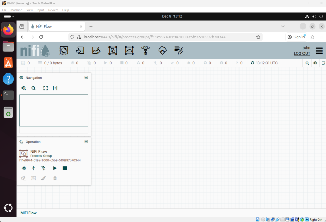

# NiFi Environment Setup
**John Calandra | www.jctechdocs.com**  
**email: john@jctechdocs.com**  
**05 Dec 2025**  
  
## Overview
This article will show you how to set up an envrionment on which you can build an Apache NiFi pipeline. The operating system (OS) and command type of the virtual machine (vm) used in this article is Ubuntu Linux and Bash. Note the following:
* A different OS and command type can be used, if you know how to translate the differences.
* It is assumed you have Linux knowledge.
* The following technologies/versions are used:
    * OpenJDK/21
    * Apache NiFi/2.6.0  

    Use them or the most current:  
    * JDK Long-Term Support (LTS) release  
    * NiFi release branch

### Notes
* Installation Directory: The /opt directory, used for installing apps that are not part of the OS.
* User Context: Log in as the default user created during the VM setup.
* Interface: All actions requiring command input are done in a terminal window. 
* Command Type: Bash commands, which is standard for Ubuntu Linux.
* Replace: 
    * \<username> with your vm username  
    * \<usergroup> with your vm usergroup
    * <12-character minimum user password> with a password
    * To find your vm usergroup run the command: groups  
You are in the sudo group, but for replacing \<usergroup> use the named group.  For example: My vm returns (john) and (sudo), so I replace \<usergroup> with john. 

## JDK Installation

1. Install headless current Java Development Kit (headless means install JDK without a GUI, which is not needed for NiFi)

    a) Update package list: sudo apt update  
    b) Install JDK: sudo apt install openjdk-21-jdk-headless  
    c) Verify installation: java --version

1. Set JAVA_HOME to prevent the JAVA_HOME warning message and ensures stability  

    a) Find your Java installation path: dirname \$(dirname \$(readlink -f $(which javac)))  
    * My vms return: /usr/lib/jvm/java-21-openjdk-amd64  
    
    b) Set $JAVA_HOME in .bashrc:  echo "export JAVA_HOME=/usr/lib/jvm/java-21-openjdk-amd64" >> /home/<username>/.bashrc  
    * When you open a terminal window, .bashrc runs and sets environment variables like $JAVA_HOME  

    c) Verify modification: cat /home/\<username>/.bashrc  
    * At the bottom of the file output you should see: export JAVA_HOME=/usr/lib/jvm/java-21-openjdk-amd64

    d) Run .bashrc manually: source /home/\<username>/.bashrc  
    * Running .bashrc makes $JAVA_HOME available for the current and all new terminal sessions (only needed after modifications)

    e) Verify JAVA_HOME: echo $JAVA_HOME
    * Should return: /usr/lib/jvm/java-21-openjdk-amd64

## NiFi Installation

1. Download NiFi

    a) Open a browser and navigate to Apache Download: https://nifi.apache.org/download/  
    b) Select Binaries/NiFi Standard 2.6.0 (or the most current version).  
    c) The selection is a zip file and will be downloaded to the following directory: /home/\<username>/Downloads directory  
    d) Verify the download: ls ~/Downloads (verify download)

1. Install NiFi into /opt

    a) Navigate to Downloads directory: cd /home/\<username>/Downloads  
    b) Install unzip: sudo apt install unzip  
    c) Install NiFi: sudo unzip /home/<username>/Downloads/nifi-2.6.0-bin.zip -d /opt    
    d) Verify insallation: ls -l /opt

1. Rename/Move the NiFi directory for manageability

    a) Naviage to opt directory: cd /opt  
    b) Rename NiFi directory: sudo mv nifi-2.6.0/ nifi/  

1. Set Permissions & Ownership

    * Allows running NiFi without using sudo, which is a security risk     
    * -R (recursive) sets permissons/ownership on all NiFi directories  

    a) Set Permissions: sudo chmod -R 755 /opt/nifi  
    b) Set Ownership: sudo chown -R \<username>:\<usergroup> /opt/nifi  

1. Set NiFi credentials and start the interface

    a) Set NiFi credentials (This command must be run first to enable secure login to the NiFi UI):  
    /opt/nifi/bin/nifi.sh set-single-user-credentials \<username> <12-character minimum user password>  
    b) Start NiFi: /opt/nifi/bin/nifi.sh start  
    c) Verify NiFi process status: /opt/nifi/bin/nifi.sh status

    * The last line of output includes: INFO [main] org.apache.nifi.bootstratp.Command Status: UP

1. Verify NiFi Interface is accessible and Login

    a) In a browser, enter in address bar: https://localhost:8443/nifi (8443 is NiFi default port)  
    b) Login using the credentials previously set  
    c) You should now see the NiFi interface:
     
      

    * If you have accessed the NiFi interface, you are ready to build a pipeline. If not, see the Troubleshooting page.  
    * If you want to stop NiFi: /opt/nifi/bin/nifi.sh stop
     
## Remote Connections
* Note that this setup does not allow remote connections to the NiFi interface (port 8443 has not been opened). 
* If you do not want remote connections, verify that NiFi is not listening on port 8443: sudo ss -tuln | grep 8443  
If port 8443 is closed, no output is returned  
* To allow (remote) TCP connections to port 8443:  
    a) This is case-senstive: sudo ufw allow 8443/tcp  
    b) Verify the port is open: sudo ss -tuln | grep 8443  
    Output should be one line that begins with TCP LISTEN  
    c) Verify that there is a firewall rule that allows remote access to port 8443: sudo ufw status verbose  
    Output should include 8443/tcp ALLOW IN ANYWHERE  
    d) To check port connectivity: nc -zv 127.0.0.1 8443  
    Output should return that the connection succeeded!

